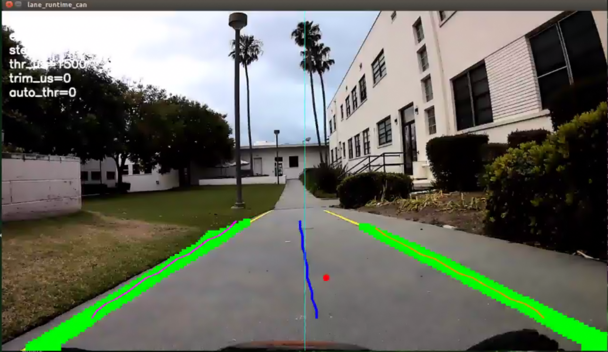
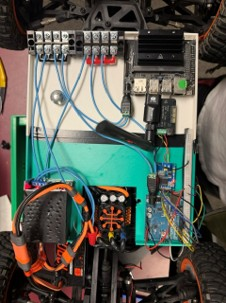
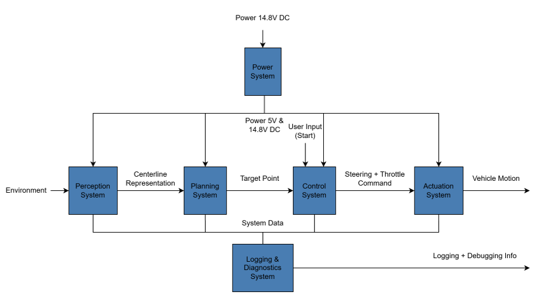

# Smart Car Autonomous Platform

Embedded autonomous vehicle platform integrating GPU-accelerated perception, real-time control, CAN communication, and hardware/software co-design on NVIDIA Jetson.

---

## Runtime Perception Pipeline



Real-time lane detection and centerline generation running on the deployed C++ TensorRT inference runtime.

---

## Embedded Hardware Integration



Integrated embedded compute, power distribution, CAN communication, and actuator control architecture mounted directly on the autonomous vehicle platform.

---

## Overview

This project is a 1/10-scale autonomous vehicle platform developed to investigate real-time embedded autonomy, computer vision, and hardware/software integration in a constrained robotic system.

The platform combines GPU-accelerated lane detection, closed-loop vehicle control, embedded communication, and low-latency system optimization to autonomously navigate outdoor driving environments using a single forward-facing camera.

The system was developed using NVIDIA Jetson embedded computing hardware alongside a dedicated microcontroller-based actuator control system connected through CAN communication.

---

## Key Features

- Real-time autonomous lane following
- TensorRT-accelerated UNet inference
- CUDA-enabled GPU execution on NVIDIA Jetson
- Pure Pursuit steering controller
- CAN-based distributed communication architecture
- Embedded Jetson + Arduino system integration
- Custom PCB integration and power distribution
- Low-latency C++ deployment runtime
- Outdoor autonomous testing and validation

---

## System Architecture



High-level embedded systems architecture showing perception, planning, control, actuation, power distribution, and diagnostics integration across the autonomous vehicle platform.

```text
Camera
   ↓
Jetson Runtime (TensorRT + CUDA)
   ↓
Lane Detection + Centerline Extraction
   ↓
Pure Pursuit Controller
   ↓
CAN Communication
   ↓
Arduino Actuation Controller
   ↓
PWM Steering / Throttle Control
```

---

## Perception & Runtime Pipeline


Detailed perception and runtime processing pipeline including image acquisition, UNet inference, lane extraction, centerline estimation, and downstream control integration.

```text
Camera Input
      ↓
Frame Preprocessing
      ↓
TensorRT UNet Inference
      ↓
Lane Mask Generation
      ↓
Boundary Extraction
      ↓
Centerline / Target Point Calculation
      ↓
Vehicle Control Interface
```

---

## Embedded Hardware Platform

The vehicle platform integrates embedded compute, power regulation, communication, sensing, and actuation subsystems into a compact autonomous robotics platform.

### Hardware Components

- NVIDIA Jetson embedded compute platform
- Arduino actuator controller
- MCP2515 CAN transceivers
- Front-facing camera
- Electronic speed controller (ESC)
- Servo steering system
- Custom PCB integration
- Dual battery power architecture
- 3D printed mounting hardware

### Hardware Integration Diagram


Embedded system power distribution and communication architecture integrating Jetson compute, CAN communication, power regulation, and actuator control subsystems.

---

## Software Stack

### Runtime
- C++
- CUDA
- TensorRT
- OpenCV
- Embedded Linux

### Development & Training
- Python
- PyTorch
- UNet segmentation pipeline

---

## Demonstration

### Autonomous Driving Highlight

[Autonomous Driving Highlight](media/demos/autonomous_lane_following_highlight.mov)

Short outdoor autonomous driving demonstration showing real-time lane following using the deployed embedded perception and control pipeline.

### Full Validation Run

The complete autonomous lap validation video is available in the repository Releases section.

---

## Real-Time Optimization

The deployed runtime was rewritten from earlier Python implementations into a performance-focused C++ inference pipeline to reduce latency and improve real-time execution stability on embedded Jetson hardware.

Optimization techniques included:
- TensorRT engine deployment
- CUDA GPU acceleration
- Streamlined runtime execution paths
- Lightweight deployment-oriented architecture
- Reduced processing overhead for real-time control operation

---

## Results

- Successful autonomous outdoor lane following
- Real-time embedded GPU inference execution
- End-to-end low-latency perception pipeline
- Full hardware/software integration on mobile vehicle platform
- Real-world testing and validation on outdoor driving paths

---

## Repository Structure

```text
docs/          -> Technical documentation, architecture diagrams, and reports
hardware/      -> CAD, PCB, power system, and integration assets
media/         -> Images, demonstrations, and visual assets
software/      -> Jetson autonomy software stack
```

---

## Documentation

### Reports
- Final Report: `docs/reports/`
- Presentations: `docs/presentations/`

### Runtime
- C++ Deployment Runtime: `software/cpp_runtime/`

### Architecture
- Functional decomposition diagrams
- Runtime processing pipeline
- Hardware integration architecture

---

## Future Improvements

- Additional sensor fusion integration
- Improved lane robustness under difficult lighting conditions
- Dynamic speed adaptation
- Expanded telemetry and diagnostics
- Enhanced localization capabilities
- Additional autonomous driving behaviors
- Improved embedded hardware modularization
- Further PCB integration and subsystem consolidation