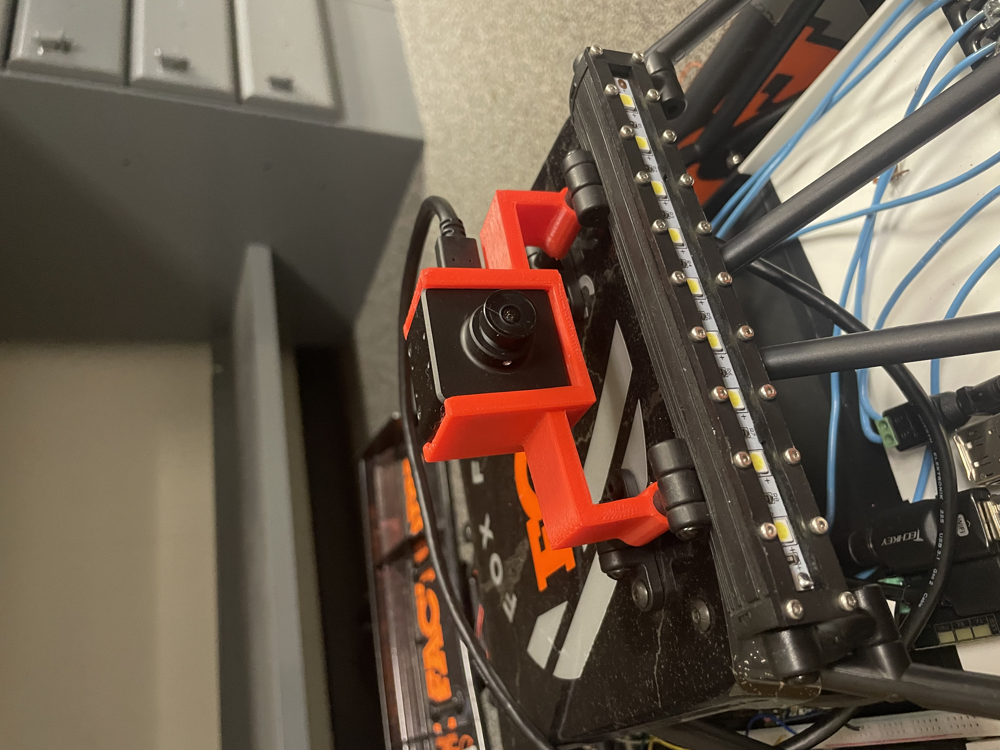
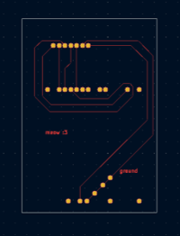
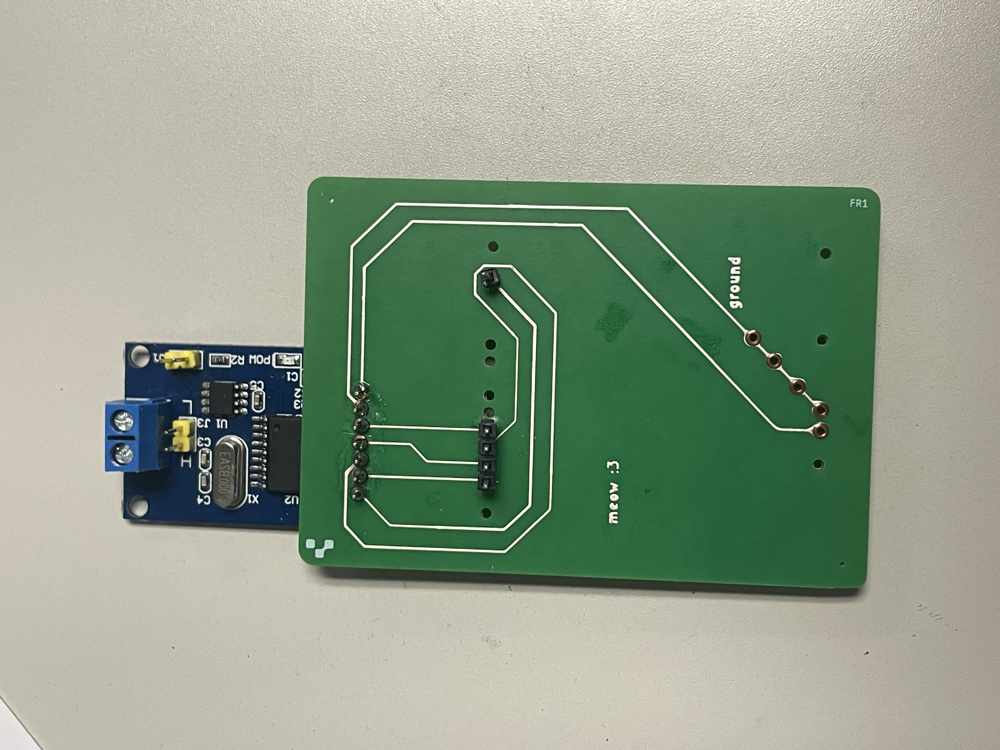
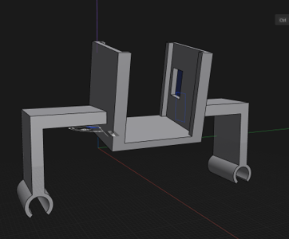
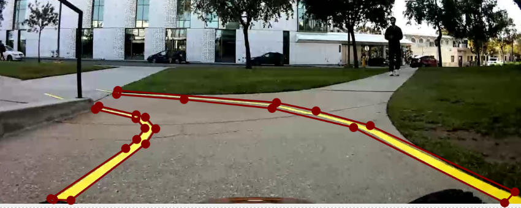
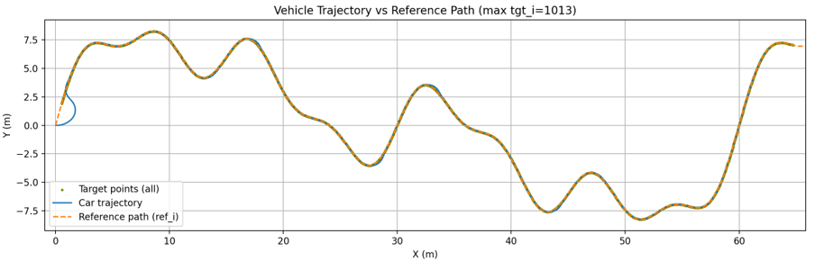
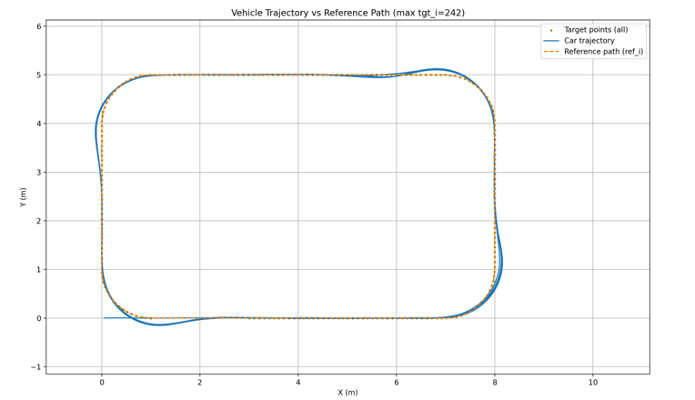
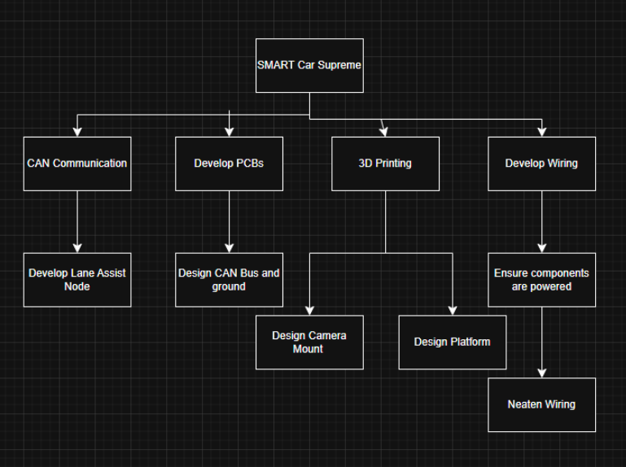
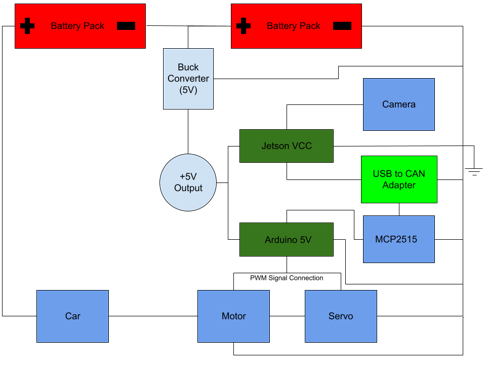
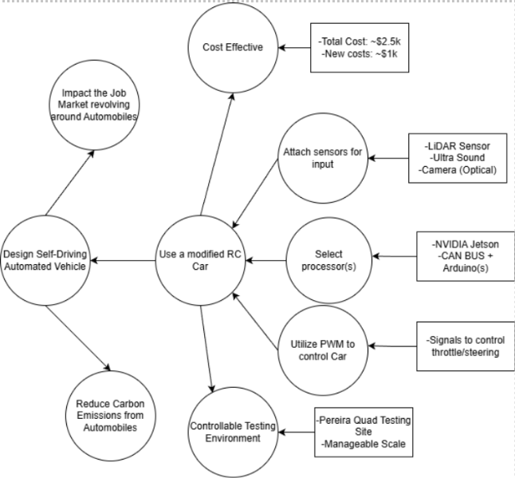

# Autonomous Vehicle Capstone

Real-time autonomous RC vehicle platform designed for embedded lane following using GPU-accelerated perception, embedded control systems, and hardware-software integration.

---

## Overview

This project focused on designing and integrating a fully embedded autonomous vehicle platform capable of real-time lane following using onboard perception and control systems. The platform combines GPU-accelerated vision inference, embedded compute hardware, low-level actuator control, and custom electrical integration into a complete autonomy pipeline running directly on the vehicle.

The system was developed on a 1/10-scale RC platform and uses a forward-facing camera for lane perception, NVIDIA Jetson embedded compute hardware for onboard inference and control processing, and an Arduino-based actuator interface for steering and throttle control.

The project emphasized real-world embedded systems engineering challenges including low-latency inference, power distribution, communication reliability, runtime optimization, subsystem integration, and autonomous operation under changing outdoor conditions.

---

## System Architecture

### Perception Pipeline
- Forward-facing monocular camera used for lane detection
- UNet-based semantic segmentation model for lane perception
- TensorRT and CUDA acceleration for embedded GPU inference
- Real-time image preprocessing and inference pipeline running onboard

### Embedded Compute & Control
- NVIDIA Jetson embedded compute platform used for onboard autonomy stack
- C++ runtime implementation for lower-latency execution
- Pure Pursuit controller for lane-following trajectory tracking
- Real-time steering and throttle command generation

### Hardware Integration
- Arduino-based actuator control interface
- CAN communication subsystem integration
- Custom PCB-based grounding and power distribution integration
- Custom CAD-designed and 3D-printed mounting hardware
- Embedded wiring and subsystem integration directly onboard vehicle

---

## Vehicle Platform

<p align="center">
  
</p>

The final vehicle platform integrated embedded compute, perception, communication, and control hardware directly onto the RC chassis while maintaining real-time autonomous operation capability.

---

## Embedded Hardware Integration

### Electronics Integration

<p align="center">
  
</p>

The onboard electronics platform integrated:
- NVIDIA Jetson embedded compute platform
- Arduino actuator interface
- CAN communication hardware
- Power regulation hardware
- Custom grounding distribution
- Embedded subsystem wiring

### Electronics Close-Up

<p align="center">
  
</p>

### Camera Mount Integration

<p align="center">
  
</p>

A custom CAD-designed and 3D-printed mounting solution was developed to securely position the forward-facing perception camera during vehicle operation.

---

## PCB & CAD Assets

### Custom Ground Distribution PCB

Custom PCB integration was developed to improve shared grounding reliability across onboard embedded subsystems.

<p align="center">
  
</p>

<p align="center">
  
</p>

### Camera Mount CAD

<p align="center">
  
</p>

Custom CAD-designed mounting hardware developed to securely integrate the forward-facing perception camera onto the vehicle chassis while maintaining stable sensor positioning during autonomous operation.

---

## Demonstration

The vehicle successfully demonstrated real-time autonomous lane following using fully onboard embedded perception and control systems during outdoor testing and public project demonstrations.

---

## Validation & Testing

The autonomous vehicle platform underwent both simulation-based controller validation and real-world outdoor testing to evaluate perception reliability, path tracking performance, and embedded runtime behavior.

### Runtime Perception Validation

<p align="center">
  
</p>

Real-time runtime overlay showing:
- lane segmentation output
- lane boundary extraction
- centerline estimation
- target point generation
- embedded runtime visualization during autonomous operation

The deployed runtime executed directly onboard NVIDIA Jetson embedded hardware using TensorRT-accelerated UNet inference.

---

## Dataset Annotation & Training Pipeline

Lane segmentation training data was manually annotated using polygon-based semantic labeling workflows to generate segmentation masks for UNet training.

### Label Annotation Workflow

<p align="center">
  
</p>

Training images were labeled using polygon-based lane annotations to generate semantic segmentation masks for embedded lane perception model training.

The dataset preparation pipeline included:
- polygon-based lane annotation
- semantic mask generation
- training dataset preprocessing
- embedded inference deployment preparation

The trained UNet segmentation model was later deployed onboard the NVIDIA Jetson platform using TensorRT-accelerated runtime inference.

---

### Controller Path Tracking Validation

<p align="center">
  
</p>

Simulation-based validation was used to evaluate Pure Pursuit controller path tracking performance across dynamically varying trajectories and changing curvature conditions.

The validation process compared:
- reference trajectory generation
- vehicle tracking response
- target point selection behavior
- controller stability across continuous path updates

---

### Additional Validation Testing

<p align="center">
  
</p>

Additional closed-loop controller validation was performed on simplified trajectories to evaluate:
- cornering behavior
- steady-state tracking performance
- path convergence behavior
- controller tuning response

---

### Outdoor Testing & Iteration

The vehicle underwent repeated outdoor testing across varying environmental conditions including:
- changing lighting conditions
- partial lane visibility
- shadows and glare
- varying path curvature

Runtime tuning, controller refinement, and perception improvements were iteratively validated through repeated autonomous test runs performed directly on the embedded platform.

---

## Design Challenges & Engineering Decisions

Developing a fully embedded autonomous vehicle platform introduced several real-world system integration and runtime challenges across perception, compute, communication, and power subsystems.

### Embedded Runtime Optimization

Early runtime implementations were developed in Python during initial perception pipeline validation. As system integration complexity increased, the runtime was rewritten into a lower-latency C++ deployment architecture using TensorRT and CUDA acceleration to improve inference throughput and real-time execution stability on embedded Jetson hardware.

### Embedded Power & Ground Integration

Integrating multiple embedded compute and actuator subsystems introduced grounding and power distribution challenges during early system integration. Shared grounding architecture and custom PCB integration were implemented to improve communication reliability and subsystem stability across the embedded platform.

### Outdoor Perception Constraints

Outdoor testing introduced difficult lighting conditions including shadows, glare, and partial lane visibility. Runtime perception tuning and controller integration were iteratively refined to improve autonomous lane-following robustness under varying environmental conditions.

### Mechanical & Sensor Integration

Custom CAD-designed and 3D-printed mounting hardware was developed to securely integrate the forward-facing perception camera and embedded electronics platform onto the vehicle chassis while maintaining stable sensor positioning during outdoor operation.

---

## System Architecture & Planning

### Work Breakdown Structure (WBS)

<p align="center">
  
</p>

A subsystem-level work breakdown structure was developed to organize hardware integration, embedded communication, PCB development, mechanical design, and vehicle wiring integration tasks across the autonomous platform.

---

### Embedded Power & Hardware Architecture

<p align="center">
  
</p>

The embedded hardware architecture integrated:
- dual battery power distribution
- shared grounding strategy
- Jetson embedded compute hardware
- Arduino actuator control
- CAN communication hardware
- camera perception input
- embedded actuator interfaces

The architecture was iteratively refined during integration to improve subsystem stability, grounding reliability, and embedded runtime robustness across onboard compute and actuator systems.

---

### Early System Concept Decomposition

<p align="center">
  
</p>

Early-stage system decomposition and concept exploration were used to evaluate:
- embedded compute platform selection
- sensor integration approaches
- actuator control strategies
- communication architecture
- scalability and testing constraints

---

## Technologies Used

### Languages
- C++
- Python

### Embedded & Compute Platforms
- NVIDIA Jetson
- Arduino

### GPU & AI Frameworks
- TensorRT
- CUDA
- UNet

### Electrical & Hardware
- CAN Bus
- PCB Design
- Embedded Power Distribution
- Hardware Integration

### CAD & Mechanical Design
- Blender
- 3D Printing

---

## Key Engineering Focus Areas

- Embedded Systems Integration
- Real-Time Systems
- GPU-Accelerated Embedded Inference
- Autonomous Vehicle Control
- Hardware-Software Integration
- Embedded Runtime Optimization
- Electrical Integration
- Communication Reliability
- Embedded AI Deployment
- Autonomous Navigation

---

## Repository Structure

```text
docs/
├── architecture/
│   └── images/
├── presentations/
├── reports/
├── testing/
│   └── images/
└── training/
    └── images/

hardware/
├── cad/
│   └── images/
├── integration/
│   └── images/
└── pcb/
    └── images/

media/
├── demos/
└── images/

software/
└── cpp_runtime/
    ├── src/
    ├── CMakeLists.txt
    └── README.md
```

---

## Author

Joshua Oliveira  
Computer Engineering  
Loyola Marymount University